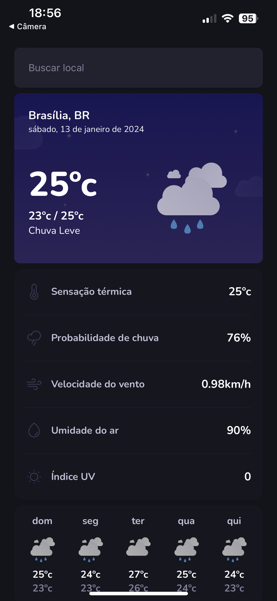
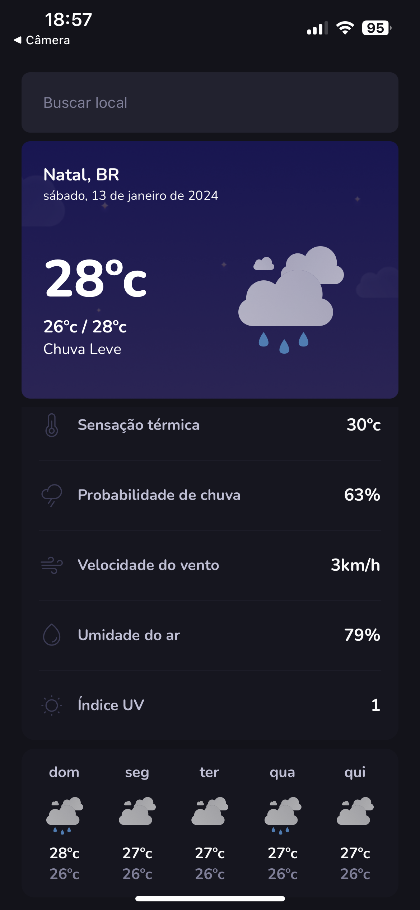
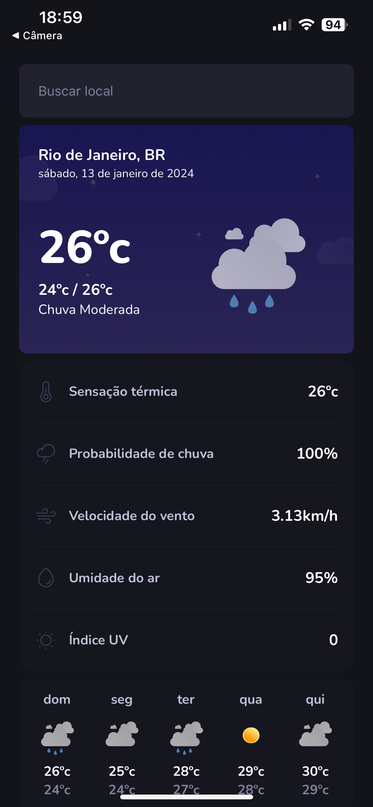

# App - I Weather

Bem-vindo ao projeto Previsão do Tempo, uma aplicação React Native que fornece informações meteorológicas em tempo real. Esta aplicação utiliza React Native, TypeScript, e integra dados de uma API confiável para manter você informado sobre as condições climáticas.

## Funcionalidades

- Visualização da Previsão: Obtenha informações precisas sobre a previsão do tempo para sua localização ou cidades selecionadas.

- Detalhes Meteorológicos: Explore detalhes como temperatura, umidade, velocidade do vento e muito mais.

- Testes Automatizados: Garantimos a confiabilidade do nosso código com testes automatizados utilizando Jest.

- Testes Unitários e de Integração: Implementamos testes unitários para validar cada componente isoladamente e testes de integração para garantir o correto funcionamento entre eles.

<!-- Contribuição
Se deseja contribuir para o desenvolvimento deste projeto, sinta-se à vontade para enviar pull requests. Estamos abertos a melhorias e novas funcionalidades. -->

<!-- Pesquisa Adicional
Para obter mais detalhes sobre o React Native, TypeScript, ou Jest, consulte a documentação oficial:

Documentação do React Native
Documentação do TypeScript
Documentação do Jest
Esperamos que desfrute da nossa aplicação Previsão do Tempo! Em caso de dúvidas ou problemas, consulte nossa documentação ou sinta-se à vontade para entrar em contato. -->

## Telas:

    
    
    
    

    
 &nbsp;
 &nbsp;
 

  